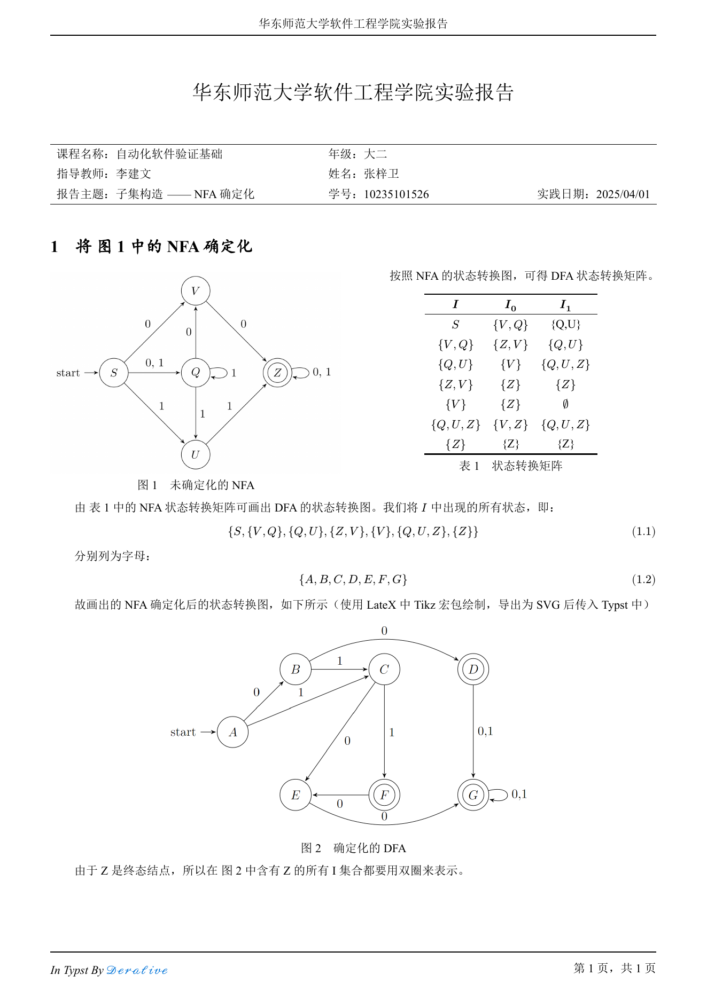
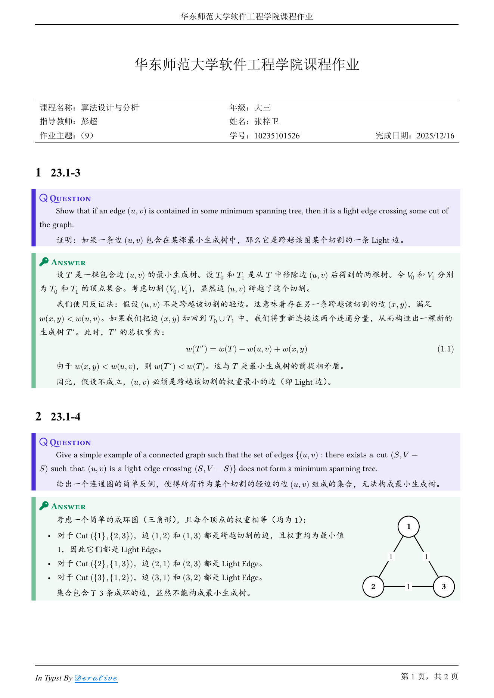
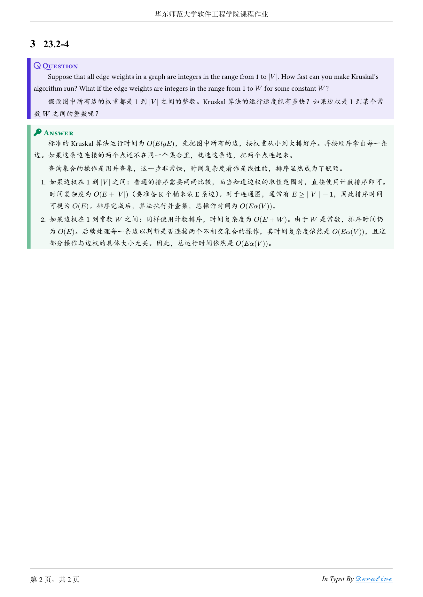

# ECNU-Typst-Lab-Report

本项目为华东师范大学软件工程学院实验报告，采用 Typst 编写。

已适配至最新版 Typst v0.14.2 / Tinymist v0.14.4

|                          Cover                          |                          Contents                          |
| :-----------------------------------------------------: | :--------------------------------------------------------: |
|  |  |

## 示例

|                           Lab3                            |
| :-------------------------------------------------------: |
|  |

---

|                               Page 1                               |                               Page 2                               |
| :----------------------------------------------------------------: | :----------------------------------------------------------------: |
|  |  |

## 参考项目

一个用 Typst 编写的笔记模板：[https://github.com/wardenxyz/xyznote](https://github.com/wardenxyz/xyznote)